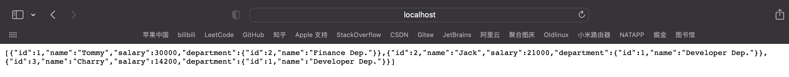

## MyBatisLearning

### 1. What's it?
A brief introduction about mybatis, a persistence framework.

### 2. How to start?
Firstly, please make sure you have installed IDEA, java 1.8, MySQL. Just execute `create.sql` to initialize database.

I use IDEA to create my project. You can just select `spring boot web`, `mybatis`, `mysql` to create a spring boot project.
Then, you must wait for IDE solve the dependencies to build the project. The entry point has an annotation called `@SpringBootApplication`.
After these, you can create entity, dao, service and controller.

**Import: you must excute create.sql and change application.xml's database
password to your own password.**

### 3. Configution
Firstly, you shoud add some mybatis configutions to `application.yml`.
```yaml
mybatis:
  type-aliases-package: com.lichen.mybatislearning.entity
  mapper-locations: classpath:mapper/*.xml
```
Type-aliases-package tells the system the entities' package, the system can find entity class automatically.
Mapper-locations tells the system where the mapper files are.

Then you can create .xml mapper files and dao class. You must add `@Mapper` for each dao class, or add `@MapperScan(basepackages="{your dao package}")` in entry class.

### 4. Mapper File
The mapper file is the solution that make sql easy in Java. Usually, it's a .xml file. You can write sql so that the Dao interface
can find the sql in mapper file and excute it.

**Important:** you must added these tags before you write mapper
if you don't use any mybatis plugin.

```xml
<?xml version="1.0" encoding="UTF-8" ?>
<!DOCTYPE mapper
        PUBLIC "-//mybatis.org//DTD Mapper 3.0//EN"
        "http://mybatis.org/dtd/mybatis-3-mapper.dtd">
```

#### 4.1 Select
There are 2 examples about how to select some records of table user.
We should use `<select>`. `<select>` has two important properties: id and resultType.
Id must refer to the Dao's method name. ResultType must refer to an entity class.

`/rest/user/list`'s response data(JSON format).


#### 4.2 Insert and Update
`<insert>` and `<update>` don't have property resultType.
So, you should use `<select>` if you want to return something when you update or insert.

When you get params in your methods, you can use `#{0}, #{1}, #{2}...`
or `#{param1}, #{param2}, #{param3}...` to find params one by one. But we usually use annotation `@Param("name"")` to
give the param unique name. After that, you should use `#{name}` but not `#{0}`.

Also, mybatis provide another param format called `${}`.
It's different from `#{}`.
For example, there is a param `title = "Manager"`,
when you create SQL in mybatis:
```xml
<select id="searchByTitle" resultType="com.xx.xx">
select * from Blog where title = '%#{title}%'
</select>
```
In fact, mybatis will excute the following SQL:
```mysql
select * from Blog where title = '%'Manager'%';
```
There is an error.
When you use `#{}`, mybatis will add **'** if param is String.
Usually it's safer because it can keep us from SQL injection.
However, you had better use `${}` when you do something above.


`/rest/user/update?id=1&salary=20000`'s response data.


#### 4.3 Delete
`<delete>` is perhaps most simple tags in mybatis. You just claim the id and write sql.

When you excute `/rest/user/delete/{id}` successfully, you will see this response.


After delete, you can excute `/rest/user/list` to check if your delete really done at database.


#### 4.4 Join
There are many situations that you may search something through many tables.
Therefore, `join` is a syntax that you must use. There are some ways
to join many tables through mybatis. However, it's a more friendly way
to use `resultmap`.

`<resultMap>` can package some records to a certain object.

`<result property="{propNmae}" column="colName">`
means that let records' value in column 'colName' be the value in object's property 'propName'.

`<association>` can package some values to a class property of object.

`<collection>` can solve the List<someclass> properties' package problem.

When you excute `/rest/user/listAll`, you'll see that:


#### 4.5 Relation
It's easy to search something if two entities are OneToOne relation or OneToMany relation.
And I realize that it's better to make a resultMap for each entity before writing SQL.
when you face the situation that two entities are ManyToMany relation, you must create another
table to record their relation. And you must use `<collection>` to make resultMap.

There is no necessary to build an entire object when you search something.
For example, when I search all the blogs belong to specific tag,
I don't need to build the entire blog object, because object blog also have an attribute
called tags.

When I excute `/rest/tag/listblog?tid=1`, I only construct blogs which don't have attribute tags.

Here is the result:


The most difficult part of mybatis is that you must claim the specific package method for each
entity. Therefore, `mybatis-generator` and `mybatis-plus` are
getting more and more popular because you can use them to build resultMap or other regular parts automatically so that
you can write less code and focus on SQL.

The advantage of mybatis I think is that you can easily write sql in mapper file.
it's easy to build dynamic sql function. Alo, it's very simple to understand.
In China, most companies and developers prefer to use mybatis as their projects' persistance
framework. But Spring Official and many foreign companies use Spring Data JPA.
I also have some experience about JPA, it's easy to create table and can do many things without SQL.
It's not so easy to excute some complex queries. Both 2 frameworks are great enough, you
can just choose one for your learning.


### 5. RESTful Controller
RESTful Controller is different from Controller. It can't return a html file(such as `login.html`).
However, it's very good for deliver data, because it will translate your Java Object to JSON. In this
project, I use RESTful Controller in order to watch response data more directly.

For example, it's the response of `/rest/user/list`.


